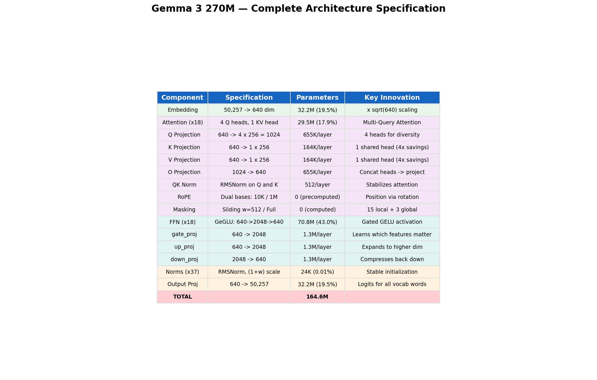
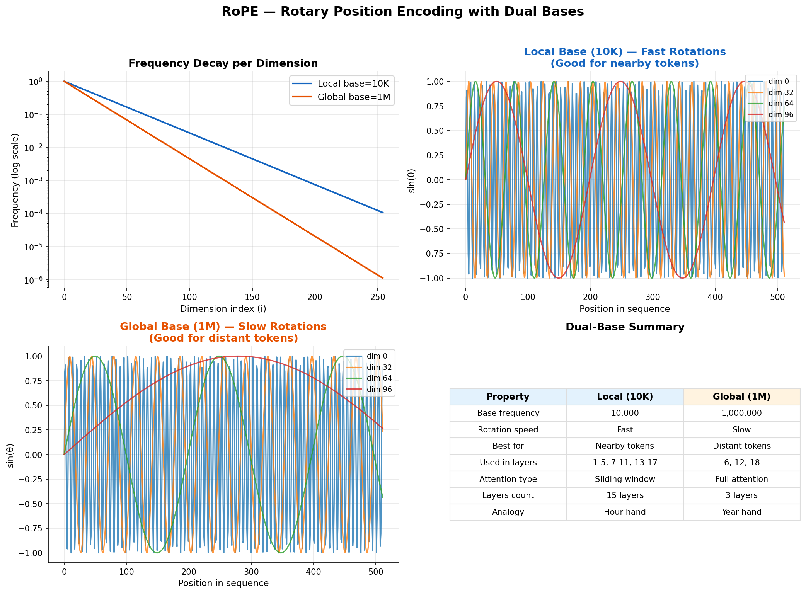
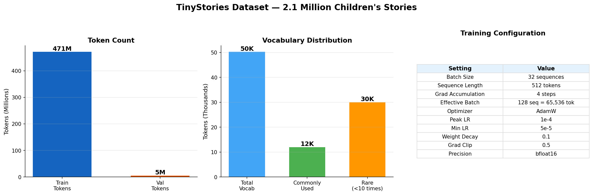
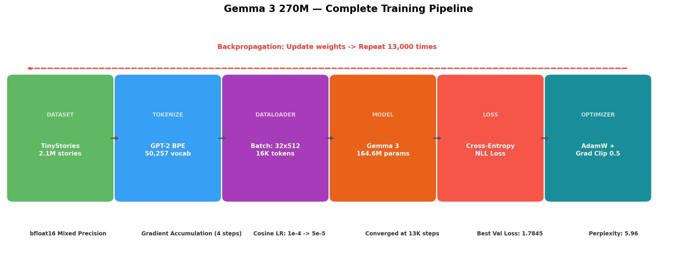
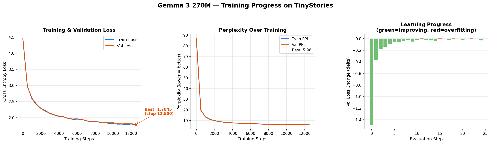

<p align="center">
  <h1 align="center">🧠 Gemma 3 270M — Pre-trained from Scratch</h1>
  <p align="center">
    <em>A complete language model — every single line written by hand — trained to write children's stories.</em>
  </p>
  <p align="center">
    <a href="https://huggingface.co/G3nadh/gemma3-270m-tinystories">🤗 HuggingFace Model</a> &nbsp;•&nbsp;
    <a href="#-quick-start-generate-stories-in-5-minutes">🚀 Quick Start</a> &nbsp;•&nbsp;
    <a href="#-how-it-works-the-simple-version">📖 How It Works</a> &nbsp;•&nbsp;
    <a href="#-architecture-deep-dive">🔬 Deep Dive</a> &nbsp;•&nbsp;
    <a href="#-train-it-yourself">🔥 Train It Yourself</a>
  </p>
  <p align="center">
    
    
    
    
    
  </p>
</p>

---

## 🎯 What Is This?

This is a **fully working AI language model** — the same type of technology behind ChatGPT, Gemini, and Claude — built **completely from scratch**. No pre-built AI libraries. No copy-pasting someone else's model. Every single component is hand-coded and explained.

**The model writes children's stories.** Give it the beginning of a story, and it continues writing:

```
You type:  "Once upon a time, there was a little cat named Mittens"

AI writes: "Mittens was very hungry and wanted to eat some food. She went
            outside to find some grass to eat. Mittens saw a big tree and
            decided to climb it. She climbed up and up until she reached
            the top. As she was in the tree, she saw a small bird with a
            broken wing. Mittens knew just what to do. She took the bird
            to her mom and asked for help."
```

### At a Glance

| What | Details |
|------|---------|
| **Architecture** | Google's Gemma 3 design (same family as their latest AI models) |
| **Parameters** | 164.6 million trainable numbers the AI learned |
| **Training Data** | 2.1 million children's stories (471 million words) |
| **Training Time** | ~12 hours on an NVIDIA A100 GPU |
| **Final Score** | Perplexity 5.96 — the AI picks the right next word from ~6 choices |
| **From Scratch** | Every component hand-coded, not using pre-built frameworks |

---

## 📋 Table of Contents

1. [🚀 Quick Start — Generate Stories in 5 Minutes](#-quick-start-generate-stories-in-5-minutes)
2. [📖 How It Works (The Simple Version)](#-how-it-works-the-simple-version)
3. [🔬 Architecture Deep Dive](#-architecture-deep-dive)
   - [Full Architecture Overview](#full-architecture-overview)
   - [RMSNorm — Keeping Numbers Stable](#1-rmsnorm--keeping-numbers-stable)
   - [RoPE — Teaching Position to the Model](#2-rope--teaching-position-to-the-model)
   - [Multi-Query Attention — The Brain](#3-multi-query-attention--the-brain)
   - [Sliding Window — Efficient Attention](#4-sliding-window--efficient-attention)
   - [GeGLU FFN — The Thinking Layer](#5-geglu-ffn--the-thinking-layer)
   - [Skip Connections — Highway for Gradients](#6-skip-connections--highway-for-gradients)
   - [Layer Pattern — Local + Global](#7-layer-pattern--local--global-attention)
4. [📊 Training — How the Model Learned](#-training--how-the-model-learned)
   - [Dataset](#dataset-tinystories)
   - [Training Pipeline](#training-pipeline)
   - [Loss Curves and Results](#loss-curves--results)
   - [Learning Rate Schedule](#learning-rate-schedule)
   - [Temperature and Sampling](#temperature--controlling-creativity)
5. [🔥 Train It Yourself](#-train-it-yourself)
6. [📁 Project Structure](#-project-structure)
7. [📏 Model Size — Where We Stand](#-model-size--where-we-stand)
8. [📝 Sample Stories](#-sample-stories)
9. [❓ FAQ](#-faq)
10. [🙏 Credits](#-credits)

---

## 🚀 Quick Start — Generate Stories in 5 Minutes

### What You Need

- **Python 3.8+** — [Download here](https://www.python.org/downloads/) if you don't have it
- **A computer** — GPU helps but is not required (CPU works, just slower)
- **5 minutes** of your time

### Step 1: Download This Project

**Option A** — If you have Git:
```bash
git clone https://github.com/YOUR_USERNAME/gemma3-270m-pretrained.git
cd gemma3-270m-pretrained
```

**Option B** — No Git? No problem:
Click the green **"Code"** button at the top of this page, then **"Download ZIP"**. Unzip it and open a terminal in that folder.

### Step 2: Install Dependencies

```bash
pip install torch tiktoken numpy matplotlib tqdm huggingface_hub
```

> **Getting errors?** Try `pip install --upgrade pip` first, then retry.

### Step 3: Download the Trained Brain (Model Weights)

The model weights (329 MB — the "brain" that learned from 2.1 million stories) are on HuggingFace:

```bash
python -c "
from huggingface_hub import hf_hub_download
path = hf_hub_download('G3nadh/gemma3-270m-tinystories', 'pytorch_model.bin')
print(f'Downloaded to: {path}')
"
```

Or download manually: [huggingface.co/G3nadh/gemma3-270m-tinystories](https://huggingface.co/G3nadh/gemma3-270m-tinystories)

### Step 4: Generate Stories!

```bash
python model.py pytorch_model.bin
```

Or write your own script:

```python
from model import load_model, generate_text

# Load the AI
model = load_model("pytorch_model.bin", device="cuda")  # Use "cpu" if no GPU

# Write a story!
story = generate_text(
    model,
    prompt="Once upon a time, there was a brave little fish",
    max_tokens=200,      # How long the story should be
    temperature=0.7,     # Creativity: 0.3=safe, 0.7=balanced, 1.0=wild
)
print(story)
```

### Step 5: Try Different Prompts

```python
prompts = [
    "The little girl found a magic key in the garden",
    "One day, a friendly dragon came to the village",
    "Mom said it was time for bed, but Tommy",
    "The big brown dog ran to the park and saw",
    "There was a tiny mouse who dreamed of being brave",
]

for prompt in prompts:
    print(f"\nPrompt: {prompt}")
    print(generate_text(model, prompt, max_tokens=150, temperature=0.7))
    print("-" * 60)
```

---

## 📖 How It Works (The Simple Version)

If you're new to AI, here's what's happening — explained so anyone can understand.

### The Big Idea: Next-Word Prediction

The AI does **ONE thing**: given some words, predict the next word.

```
Input:  "The cat sat on the"  -->  AI predicts: "mat"   (correct!)
Input:  "Once upon a"         -->  AI predicts: "time"  (correct!)
Input:  "She was very"        -->  AI predicts: "happy" (correct!)
```

That's it. That's ALL it does. By repeating this trick hundreds of times, it writes entire stories:

```
Step 1:   "Once upon a"                        -->  "time"
Step 2:   "Once upon a time"                   -->  ","
Step 3:   "Once upon a time,"                  -->  "there"
Step 4:   "Once upon a time, there"            -->  "was"
Step 5:   "Once upon a time, there was"        -->  "a"
  ...repeat 200 more times...
Step 200: Full story about a little cat named Mittens!
```

### How Did It Learn?

We showed the AI **2.1 million children's stories** and said:

> *"For every word in every story, try to guess the next word. When you're wrong, adjust yourself slightly to be less wrong next time."*

It did this **billions of times** over 12 hours. Slowly, it learned:

- **English grammar** — "the" is usually followed by a noun
- **Story patterns** — "Once upon a time" leads to something magical
- **Character behavior** — moms say "time for bed", dogs "run to the park"
- **Emotions** — characters feel "happy", "sad", "scared", "brave"

### The Three Main Parts

```
+-------------------------------------------------------------+
|                    THE AI MODEL                              |
|                                                              |
|  (1) INPUT: Convert words to numbers                         |
|      "The cat sat"  -->  [464, 3797, 3332]                  |
|                |                                             |
|                v                                             |
|  (2) THINKING: 18 layers of processing                       |
|      Each layer looks at the words and builds                |
|      understanding of context and meaning                    |
|                |                                             |
|                v                                             |
|  (3) OUTPUT: Score all 50,257 possible next words            |
|      "mat"=15%, "floor"=12%, "dog"=8%, ...                  |
|      Pick one  -->  "mat"                                    |
+-------------------------------------------------------------+
```

---

## 🔬 Architecture Deep Dive

This section explains **every component** inside the model. Each part includes a visual diagram and a plain-English explanation.

### Full Architecture Overview

<p align="center">
  
</p>

The model has **164.6 million parameters** (trainable numbers). Here's where they live:

<p align="center">
  
</p>

**Key takeaway:** The FFN (thinking layers) use 43% of all parameters — that's where most of the "intelligence" lives. The embedding and output layers are large because our vocabulary has 50,257 words.

---

### 1. RMSNorm — Keeping Numbers Stable

**Problem:** As numbers flow through 18 layers, they can explode (become huge) or vanish (become tiny). Either way, the model can't learn.

**Solution:** RMSNorm normalizes the numbers at each layer, keeping them in a healthy range.

<p align="center">
  
</p>

**Gemma 3's Innovation — (1 + weight) scaling:**

Most models use `weight * normalized_value`. Gemma 3 uses `(1 + weight) * normalized_value`.

Why does this matter?
- Weights start at **0** during initialization
- So `(1 + 0) * value = value` — the layer starts as an **identity function** (passes data through unchanged)
- The model can then **gradually** learn to adjust, instead of starting with random scaling
- This makes early training much more **stable**

```python
# Standard approach (can be unstable):
output = weight * normalized_x       # weight starts at ~1.0 (random)

# Gemma 3 approach (stable!):
output = (1 + weight) * normalized_x  # weight starts at 0, so (1+0) = identity
```

---

### 2. RoPE — Teaching Position to the Model

**Problem:** The model sees words as a bag of numbers — it doesn't know that "cat" in position 1 is different from "cat" in position 100.

**Solution:** RoPE (Rotary Position Encoding) **rotates** each word's numbers by an angle that depends on its position. Words in different positions get rotated differently, so the model can tell them apart.

<p align="center">
  
</p>

**Gemma 3's Innovation — Dual Bases:**

Instead of one rotation speed, Gemma 3 uses **two**:

| Property | Local Base (10,000) | Global Base (1,000,000) |
|----------|-------------------|----------------------|
| **Rotation speed** | Fast | Slow |
| **Good for** | Nearby words | Distant words |
| **Used in** | 15 sliding layers | 3 full attention layers |
| **Analogy** | Hour hand on a clock | Year hand on a calendar |

Think of it like this:
- **Fast rotation (10K):** Like an hour hand — moves quickly, so you can tell if two events are 1 hour apart vs 3 hours. Great for **nearby** words.
- **Slow rotation (1M):** Like a calendar — moves slowly, so you can tell if events are months apart. Great for **long-range** story structure.

---

### 3. Multi-Query Attention — The Brain

**What is Attention?** It's how the model decides which previous words matter for predicting the next word.

Example: In "The **cat** sat on the ___", the model should pay most attention to "**cat**" to predict "mat".

**The Innovation — Multi-Query Attention (MQA):**

Standard models give every "reader" (head) its own copy of the dictionary (keys and values). Gemma 3 makes all readers **share one dictionary** — 4x less memory!

<p align="center">
  
</p>

**How it works:**
- **4 Query heads** — four different "questions" the model asks about the input
- **1 Key head** — one shared "lookup table" (instead of 4 separate ones)
- **1 Value head** — one shared "answer book" (instead of 4 separate ones)
- **Result:** Same quality, 4x less memory for the KV cache

```
Standard:  4 Query x 4 Key x 4 Value = 12 projections  -->  1,024 dim KV cache
Gemma 3:   4 Query x 1 Key x 1 Value =  6 projections  -->    256 dim KV cache
                                                               (4x cheaper!)
```

---

### 4. Sliding Window — Efficient Attention

**Problem:** Standard attention lets every word look at ALL previous words. With 32,768 positions, that's 32,768 x 32,768 = **1 billion** comparisons per layer!

**Solution:** Sliding window attention — each word only looks at the **last 512 words** (the "window"). For local patterns like grammar and sentence structure, you don't need to see the whole document.

<p align="center">
  
</p>

**The key insight:** Gemma 3 uses **both types**:
- **15 layers** with sliding window (fast, local patterns like grammar)
- **3 layers** with full attention (slow but sees everything — for plot and character tracking)

```
Sliding Window:  O(n x 512)   = 16 million comparisons    <-- Fast!
Full Attention:  O(n x n)     = 1 billion comparisons      <-- But only 3 layers
Combined:        Best of both worlds!
```

---

### 5. GeGLU FFN — The Thinking Layer

After attention decides **which words are important**, the FFN processes that information — it's where the actual "thinking" happens.

<p align="center">
  
</p>

**How GeGLU works:**
1. **Expand:** Take 640 dimensions, expand to 2,048 (3.2x bigger workspace)
2. **Gate:** One path learns **which features matter** (the "gate")
3. **Activate:** GELU activation adds non-linearity (the model can learn curves, not just lines)
4. **Multiply:** Gate x expanded features = filtered thinking
5. **Compress:** 2,048 back to 640 dimensions

**Why gating matters:** Without the gate, all 2,048 features are treated equally. With gating, the model learns to **focus on what matters** and ignore noise.

```python
# Without gating (standard):
output = down_proj(GELU(up_proj(x)))         # All features treated equally

# With gating (GeGLU - Gemma 3):
output = down_proj(GELU(gate(x)) * up(x))    # Gate selects important features
```

---

### 6. Skip Connections — Highway for Gradients

**Problem:** In a deep network (18 layers), information from early layers gets weaker and weaker as it passes through. By layer 18, the learning signal (gradient) may have vanished completely.

**Solution:** Skip connections add a "highway" that lets information bypass layers entirely.

<p align="center">
  
</p>

```python
# Without skip connection:
output = layer(x)              # Signal degrades through each layer

# With skip connection:
output = layer(x) + x          # Original signal always preserved!
```

**Why it works:** The `+ x` means the original input is always preserved. The layer only needs to learn what to **add** to the input, not reconstruct everything from scratch. This makes learning much easier.

---

### 7. Layer Pattern — Local + Global Attention

The 18 transformer layers alternate between two types:

<p align="center">
  
</p>

```
Layers  1-5:   Sliding Attention (local, RoPE base=10K)   <-- Grammar, phrases
Layer   6:     Full Attention (global, RoPE base=1M)       <-- Character tracking
Layers  7-11:  Sliding Attention (local, RoPE base=10K)   <-- Sentence structure
Layer  12:     Full Attention (global, RoPE base=1M)       <-- Plot coherence
Layers 13-17:  Sliding Attention (local, RoPE base=10K)   <-- Word choice, style
Layer  18:     Full Attention (global, RoPE base=1M)       <-- Story understanding
```

**Pattern:** Every 6th layer is a "full attention" layer (layers 6, 12, 18). This gives the model a chance to "zoom out" and look at the big picture periodically.

---

## 📊 Training — How the Model Learned

### Dataset: TinyStories

We trained on the [TinyStories](https://huggingface.co/datasets/roneneldan/TinyStories) dataset — 2.1 million short children's stories written by GPT-3.5/4, designed specifically for training small language models.

<p align="center">
  
</p>

| Property | Value |
|----------|-------|
| Total stories | ~2.1 million |
| Train tokens | 471 million |
| Validation tokens | 4.7 million |
| Vocabulary | 50,257 (GPT-2 BPE tokenizer) |
| Sequence length | 512 tokens per sample |
| Language | English (simple, age 3-5 level) |

### Training Pipeline

Here's the complete end-to-end training process:

<p align="center">
  
</p>

**Step by step:**
1. **Load stories** from TinyStories dataset
2. **Tokenize** — convert words to numbers using GPT-2's tokenizer (50,257 vocabulary)
3. **Batch** — group 32 sequences of 512 tokens each
4. **Forward pass** — model predicts next word for every position
5. **Calculate loss** — how wrong was the model? (cross-entropy loss)
6. **Backpropagation** — calculate how to adjust each of the 164.6M parameters
7. **Update weights** — AdamW optimizer adjusts parameters
8. **Repeat** — 13,000 times until the model converges

### Loss Curves & Results

<p align="center">
  
</p>

| Metric | Value |
|--------|-------|
| **Best Validation Loss** | 1.7845 |
| **Perplexity** | 5.96 |
| **Best Iteration** | 13,000 |
| **Training Time** | ~12 hours on A100 |

**What does perplexity 5.96 mean?**

On average, when the model predicts the next word, it narrows down the choices to about **6 words** (out of 50,257 total). Lower is better — a perfect model would have perplexity 1.0.

```
Untrained model:  perplexity ~50,257  (random guessing among all words)
After 1K steps:   perplexity ~90      (learning basic English)
After 5K steps:   perplexity ~20      (learning story patterns)
After 13K steps:  perplexity 5.96     (converged! writing coherent stories)
```

### Learning Rate Schedule

<p align="center">
  
</p>

The learning rate controls **how big** each update step is:

- **Warmup (0 to 1K steps):** Start tiny, gradually increase to full speed. Like warming up before a sprint — prevents wild jumps early on.
- **Cosine decay (1K to 60K steps):** Gradually slow down. Big steps first to find the general direction, small steps later to fine-tune details.
- **Minimum LR (60K+):** Very small steps. Our model converged at 13K steps so we stopped early.

### Temperature — Controlling Creativity

When generating stories, **temperature** controls how "creative" vs "predictable" the AI is:

<p align="center">
  
</p>

| Temperature | Behavior | Best For |
|-------------|----------|----------|
| **0.3** | Almost always picks the #1 most likely word | Safe, predictable output |
| **0.7** | Good balance of quality and variety | **Recommended for most use** |
| **1.0** | More randomness, surprising word choices | Creative but can be weird |

---

## 🔥 Train It Yourself

Want to train this model from scratch? Here's how.

### Requirements

| Resource | Minimum | Recommended |
|----------|---------|-------------|
| **GPU** | Any NVIDIA GPU (8GB+) | A100 40GB |
| **RAM** | 16 GB | 32 GB |
| **Disk** | 10 GB free | 20 GB free |
| **Time** | ~48 hrs (RTX 3060) | ~12 hrs (A100) |
| **Cost** | Free (Colab free tier) | ~$12 (Colab Pro) |

### Option A: Google Colab (Recommended for Beginners)

1. Open the notebook: [](https://colab.research.google.com/github/YOUR_USERNAME/gemma3-270m-pretrained/blob/main/notebooks/Gemma3_Pretrain.ipynb)
2. Go to **Runtime** then **Change runtime type** then select **T4 GPU** (or A100 with Colab Pro)
3. Run all cells in order
4. Your model will be saved to Google Drive

### Option B: Local Machine

```bash
# 1. Clone and install
git clone https://github.com/YOUR_USERNAME/gemma3-270m-pretrained.git
cd gemma3-270m-pretrained
pip install -r requirements.txt

# 2. Download and prepare data
python prepare_data.py

# 3. Train
python train.py

# 4. Generate stories
python model.py checkpoints/best_model.pt
```

### Training Configuration

All hyperparameters used in training:

| Setting | Value | Why |
|---------|-------|-----|
| Optimizer | AdamW | Industry standard, includes weight decay |
| Learning Rate | 1e-4 to 5e-5 | Cosine decay with warmup |
| Warmup Steps | 1,000 | Prevents early instability |
| Batch Size | 32 | Sequences per forward pass |
| Gradient Accumulation | 4 | Effective batch = 128 sequences |
| Sequence Length | 512 | Tokens per sequence |
| Weight Decay | 0.1 | Regularization to prevent overfitting |
| Gradient Clipping | 0.5 | Prevents exploding gradients |
| Precision | bfloat16 | 2x faster training, same quality |
| Beta1, Beta2 | 0.9, 0.95 | Adam momentum parameters |

---

## 📁 Project Structure

```
gemma3-270m-pretrained/
|
|-- README.md                          <-- You are here!
|-- model.py                           <-- Complete model code (single file, runnable)
|-- train.py                           <-- Training script
|-- requirements.txt                   <-- Python dependencies
|-- .gitignore
|
|-- notebooks/
|   +-- Gemma3_Pretrain.ipynb          <-- Full Colab notebook (run everything)
|
+-- assets/
    +-- visuals/                       <-- All diagrams and charts (15 images)
        |-- 01_parameter_breakdown.png
        |-- 02_layer_types_pattern.png
        |-- 03_mqa_vs_standard.png
        |-- 04_attention_masks.png
        |-- 05_rope_dual_base.png
        |-- 06_training_curves.png
        |-- 07_lr_schedule.png
        |-- 08_model_size_comparison.png
        |-- 09_dataset_statistics.png
        |-- 10_geglu_ffn.png
        |-- 11_rmsnorm.png
        |-- 12_temperature_effect.png
        |-- 13_architecture_table.png
        |-- 14_training_pipeline.png
        +-- 15_skip_connections.png
```

---

## 📏 Model Size — Where We Stand

Let's be honest about where this model fits in the AI landscape:

<p align="center">
  
</p>

| Model | Parameters | Training Cost | Can Write Stories? |
|-------|-----------|--------------|-------------------|
| **Our Gemma 3** | **164M** | **~$12** | **Yes! Children's stories** |
| GPT-2 Small | 124M | ~$5,000 | Basic text |
| GPT-2 XL | 1.5B | ~$50,000 | Decent text |
| Llama 3.2 3B | 3B | ~$500,000 | Good text |
| Llama 3.1 70B | 70B | ~$10,000,000 | Great text |
| GPT-4 | ~1T+ | ~$100,000,000+ | Human-level text |

**Our model is tiny but real.** It proves you understand every piece of how modern LLMs work. The architecture is identical to Google's Gemma 3 — just scaled down.

---

## 📝 Sample Stories

### Story 1 — Temperature 0.7 (Balanced)

**Prompt:** *"Once upon a time, there was a little cat named Mittens"*

> Mittens was very hungry and wanted to eat some food. She went outside to find some grass to eat. Mittens saw a big tree and decided to climb it. She climbed up and up until she reached the top. As she was in the tree, she saw a small bird with a broken wing. Mittens knew just what to do. She took the bird to her mom and asked for help. Her mom wanted her to help. She gave the bird some food and water. Mittens was happy and said thank you.

### Story 2 — Temperature 0.7

**Prompt:** *"Mom said it was time for bed, but Tommy"*

> wasn't sure. He wanted to keep playing. His mom said, "Tommy, it's time for bed now. You can play later." But Tommy didn't listen. He kept playing with the phone and made it go on the floor. But then, his mom said, "Why don't you play and have some fun? You're both a good boy." Tommy replied, "Okay mom, I won't play with the phone." His mom smiled, and they went to the bathroom, where Tommy was playing with his toys instead.

### Story 3 — Temperature 0.3 (Conservative)

**Prompt:** *"Once upon a time, there was a little cat named Mittens"*

> Mittens loved to play with her toy mouse and eat cheese. One day, Mittens saw a big piece of cheese on the floor. She wanted to eat it, but she knew she had to wait until she was older.

### Story 4 — Temperature 1.0 (Creative)

**Prompt:** *"Once upon a time, there was a little cat"*

> It was walking in a field when it saw something shiny in the grass. It was a stone. He was so excited! It looked so delicious! The cat asked the stone if it could try. The stone was so big that it was very heavy. The cat tried and tried, but it could not do it. The cat started to cry.

---

## ❓ FAQ

### "Can I use this for anything other than children's stories?"

Not really. It was trained only on children's stories (TinyStories dataset). It doesn't know about science, history, code, or adult conversation. For other tasks, you'd need to train on different data.

### "Why not train a bigger model?"

Cost. Our model cost ~$12 on Google Colab. A 7B model costs $50,000-500,000. This project is about **understanding the architecture**, not competing with GPT-4.

### "Why does the model sometimes repeat itself?"

Small models (164M parameters) have limited working memory. They maintain coherence for about 80-100 tokens before patterns start looping. Larger models (7B+) have much less repetition.

### "Can I fine-tune this on my own data?"

Yes! Load the weights from [HuggingFace](https://huggingface.co/G3nadh/gemma3-270m-tinystories) and continue training on your dataset. You need a GPU with at least 8GB VRAM.

### "What GPU do I need?"

For **generating stories**: Any GPU works, even CPU (just slower). For **training from scratch**: Minimum 8GB VRAM (RTX 3060). Recommended: A100 via Google Colab Pro ($12/month).

### "How is this different from downloading GPT-2?"

GPT-2 is a black box you download from OpenAI. This project implements **every single component from scratch**: tokenization, embedding, attention, FFN, normalization, positional encoding, training loop, optimizer — everything. You can read and understand every line.

---

## 🙏 Credits

- **Architecture Reference:** [Vizuara Team — Raj](https://youtu.be/bLDlwcl6hbA) (Gemma 3 implementation tutorial)
- **Dataset:** [TinyStories](https://huggingface.co/datasets/roneneldan/TinyStories) by Ronen Eldan and Yuanzhi Li
- **Tokenizer:** [tiktoken](https://github.com/openai/tiktoken) (GPT-2 BPE) by OpenAI
- **Training Hardware:** NVIDIA A100 40GB via Google Colab Pro
- **Framework:** PyTorch (only torch — no HuggingFace Transformers library)

---

## 📄 License

This project is licensed under **Apache 2.0** — you can use, modify, and distribute it freely.

---

<p align="center">
  <b>Built with curiosity and 164.6 million parameters.</b><br>
  <a href="https://huggingface.co/G3nadh/gemma3-270m-tinystories">🤗 HuggingFace</a> &nbsp;•&nbsp;
  <a href="#-quick-start-generate-stories-in-5-minutes">🚀 Quick Start</a> &nbsp;•&nbsp;
  <a href="#-architecture-deep-dive">🔬 Architecture</a>
</p>
